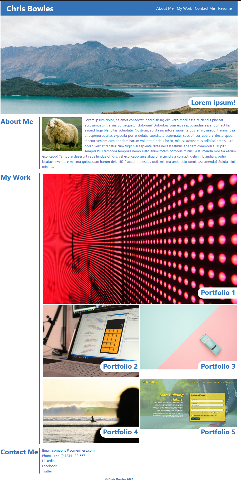

# My Portfolio

## Description

Build a portfolio page to demonstrate the skills learnt during the boot camp. This page will added to and enhanced as the course progresses.

The initial aims are:

- When the page is loaded the page presents your name, a recent photo or avatar, and links to sections about you, your work, and how to contact you.
- When one of the links in the navigation is clicked then the UI scrolls to the corresponding section.
- When viewing the section about your work then the section contains titled images of your applications.
- When presented with the your first application then that application's image should be larger in size than the others.
- When images of the applications are clicked then the user is taken to that deployed application.
- When the page is resized or viewed on various screens and devices then the layout is responsive and adapts to my viewport.

For the time being I have linked the projects to some random pages instead of actual sample projects.

Further work to do:
- Improve HTML of the project cards, probably should make more use of classes.
- Tidy and optimise CSS.
- Add a hover effect to the project cards (maybe with a transition).
- I would also like some improvement in the sizes of the project cards and centering of the images displayed.

The live page can be found here, [https://fezzer.github.io/my_portfolio/](https://fezzer.github.io/my_portfolio/)

## Credits

The initial structure was copied from the starter folder provided in the course material and the reset.css was copied from the solved week 2 06-Stu-CSS-Variables solution.

## License

Please see the license included in this repo.